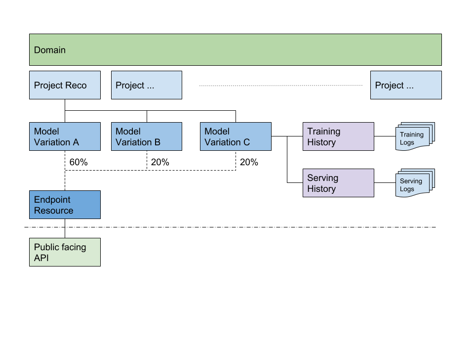

# ML Pipeline Service
A pipeline for **Train**, **Serve**, **Experiment** in machine learning projects

## WHY:
>>https://twitter.com/AndrewYNg/status/1080886439380869122  
The rise of Software Engineering required inventing processes like version control, code review, agile, to help teams work effectively. The rise of AI & Machine Learning Engineering is now requiring new processes, like how we split train/dev/test, model zoos, etc. -- Andrew Ng, Jan 2019

## WHAT
This service serves as infomation hub, so we can have clear overview of all ML projects running in domain.

### **Service is designed to be a ML infomation hub**
It keeps the track of all different projects details:  
*training history,  
*serving histories  
*model variations,  

so we can track, maintain and fallkack to a specified model version with ease.

it also serves as a model zoo repo for all ML projects, so all that all non-ML developers can find production ready model resources then use them into their own project.

### **This service is designed to be OPEN.**
This service is designed to **Train**/**Serve**/**Experiment** different ML projects and models with **ANY ML framework** of developers' choice.  

you can use popular frameworks like tensorflow, pytorch, MXnet, etc., 
or if you like you can also roll your own algo.

Serivce can support production ready endpoint resources. On the other hand,it also want to maxmize the flexibility when users are just experimenting/learning ml models.

Secondly, all three **Train** **Serve** **Experiment** major feature is supported within the service, but you can also cherry pick the features you need.
e.g. You can do training then serve the saved model elsewhere, or vice versa, you can just use the platform for serving if you already have a trained model ready.

## How it works

Every ML project is defined into 3 parts:
* project
* models
* jobs

### project
project defined the top level information of the a machine learning project:  
i.e:
* what is the project
* status of the project
* weights allocation across different model variations on inference (if there is more than 1)
* time stamps
* latest serving status
* etc.

### models
models is under project.  
one project could have one or more model variations. so each variation of model will have it own specs.  
i.e:  
* model variation name
* **Default** hardware specs for serving (and training enviroment)
* etc.

### jobs
jobs have two differnt types **"serve"** and **"train"**  
job contains a snapshot information of current model settings.  
In case of replicating or needing fallback to certain model, we can use metadata log inside the job to replay specifed model exactly. (see: endpoint "/{job_id}/rerun)  
job contain infomations like:
* serve/traing spec
* enviroment variables
* image container (algo)
* saved model path (or saved model output path in trianing)
* job status
* timestamps

This service is powered by aws sagemaker, as a result all infrastructure resources will be handled and managed by AWS. (i.e logs, load balancing, etc.)  
infrastructure resource can be request on demand, with out further overhead from devops.

